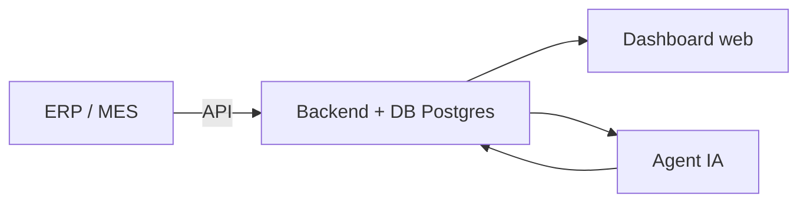

# FabricPulse — Production Intelligence pour l'industrie textile

> **Système de production-intelligence avec assistant IA** — un dashboard de pilotage multi-sites + un agent conversationnel qui répond en langage naturel sur la production, la qualité, les commandes et la capacité.

Démonstration fonctionnelle calquée sur le fonctionnement d'un groupe textile exportateur intégré (confection, tricotage, teinture, délavage, sérigraphie, coupe, finissage) réparti sur plusieurs sites de production.

---

## 🎯 Pourquoi ce projet existe

Un groupe textile de cette taille ne manque pas de données — il manque de **synthèse**. Les indicateurs (productivité horaire, taux de rebut, respect des délais, occupation des capacités) vivent souvent dans des fichiers Excel séparés par site et par atelier.

FabricPulse répond à trois problèmes concrets :

1. **Visibilité consolidée** — tous les sites, toutes les étapes, toutes les marques sur un seul écran, avec les écarts plan/vréel.
2. **Détection précoce** — alertes quand un atelier dérape (retard, taux de rebut en hausse, capacité insuffisante) avant que le client ne s'en rende compte.
3. **Accès immédiat à l'information** — un assistant IA qui répond en français, sans formation : *« quelles commandes sont à risque ? »*, *« comment va la production aujourd'hui ? »*, *« quels sont les principaux défauts ? »*.

Toutes les données sont **simulées mais réalistes** : les sites, les étapes et les marques reproduisent la structure réelle d'un groupe exportateur. Aucune donnée client, aucun branchement ERP nécessaire pour démontrer la valeur.

---

## ✨ Fonctionnalités

| Module | Ce qu'il fait |
|---|---|
| **Vue d'ensemble** | KPIs du jour, courbe production plan/vréel sur 14 jours, volume par étape, commandes récentes, alertes |
| **Production** | Suivi commande par commande (réf., marque, produit, quantité, avancement, site, échéance), filtre par marque |
| **Qualité & Défauts** | Top défauts par site, dernier signalement de non-conformité, indicateurs qualité du mois |
| **Sites & Unités** | Carte des unités : effectif, machines, taux d'utilisation, taux de défauts, statut d'avancement |
| **Alertes** | Centre de notifications hiérarchisé (critique / avertissement / information) avec recommandation |
| **Assistant IA** | Agent conversationnel qui interroge les données en langage naturel et répond avec tableaux et synthèses |

### Assistant IA — exemples de questions

- `Résumé de la situation actuelle`
- `Quelles commandes sont à risque ?`
- `Comment se passe la production aujourd'hui ?`
- `Quels sont les principaux défauts qualité ?`
- `Performance des marques clients`
- `État d'utilisation des sites`
- `Volumes par étape de production`
- `Montrer les alertes actives` (et toute reformulation : *« qui est en retard ? »*, *« du neuf chez Lacoste ? »*, etc.)

---

## 🚀 Installation & lancement

### Prérequis

- **Node.js** ≥ 18 (testé sur Node 22)
- **npm** ≥ 9

### 1. Installer les dépendances

```bash
npm install
```

### 2. Lancer le serveur de développement

```bash
npm run dev
```

Ouvrir <http://localhost:5173> (le port est affiché dans le terminal).

### 3. Lancer l'assistant IA

Il est activé par défaut dans le panneau latéral droit. Vous pouvez l'ouvrir/fermer via le bouton **« Assistant IA »** dans la barre latérale gauche, ou avec la croix **×** du panneau.

### 4. Build de production (optionnel)

```bash
npm run build   # → dossier dist/
npm run preview # → sert le build localement
```

---

## 🧭 Structure du projet

```
vtp-production-intelligence/
├── index.html
├── package.json
├── vite.config.ts          # Vite + Tailwind CSS
└── src/
    ├── main.tsx            # Point d'entrée React
    ├── App.tsx             # Routage (react-router) + état de l'assistant
    ├── index.css           # Thème, palette, style global
    ├── types.ts            # Types du domaine (sites, commandes, défauts, alertes…)
    ├── data.ts             # Données de démonstration (sites, commandes, défauts…)
    ├── agent.ts            # Moteur de l'assistant IA (parseur d'intention + générateur de réponse)
    ├── components/
    │   ├── Layout.tsx      # Barre latérale + panneau assistant
    │   ├── AssistantChat.tsx  # Interface de chat
    │   └── ui.tsx          # Composants réutilisables (StatCard, Panel, badges…)
    └── pages/
        ├── Dashboard.tsx   # Vue d'ensemble
        ├── Production.tsx  # Suivi des commandes
        ├── Quality.tsx     # Qualité & défauts
        ├── Sites.tsx       # Sites & unités
        └── Alerts.tsx      # Centre d'alertes
```

---

## 🗄️ Modèle de données (mock)

Toute la donnée vit dans `src/data.ts` et est typée dans `src/types.ts`.

### Étape de production

| id | Nom (FR) | Icône |
|---|---|---|
| `knit` | Tricotage | 🔄 |
| `dye` | Teinture | 🎨 |
| `wash` | Délavage | 💧 |
| `print` | Sérigraphie | 🖨️ |
| `cut` | Coupe | ✂️ |
| `sew` | Confection | 🪡 |
| `finish` | Finissage | 🏁 |

### Site / Unité

```ts
type Site = {
  id: string;
  name: string;          // ex. "Menzel Temime — Bonneterie"
  location: string;
  focus: string[];       // étapes sur lesquelles l'unité est spécialisée
  employees: number;
  machines: number;
  status: 'optimal' | 'watch' | 'attention';
  utilization: number;   // % occupation des capacités
  defectRate: number;    // % taux de défauts
  onSchedule: boolean;
};
```

### Commande de production

```ts
type ProductionOrder = {
  reference: string;     // ex. "PO-LCO-2214"
  brand: string;         // Lacoste, Adidas, G-Star, Paul & Shark, Karl Lagerfeld
  product: string;
  quantity: number;
  siteId: string;        // rattachée à une unité
  stage: string;         // étape en cours
  progressPct: number;   // % d'avancement
  dueDate: string;       // échéance
  status: 'on_track' | 'at_risk' | 'delayed';
  priority: 'low' | 'medium' | 'high' | 'critical';
  colorways: number;     // nombre de coloris
};
```

### Alertes

```ts
type AlertItem = {
  severity: 'critical' | 'warning' | 'info';
  type: 'delay' | 'quality' | 'maintenance' | 'capacity';
  title: string;
  description: string;   // inclut une recommandation actionnable
};
```

---

## 🤖 Comment fonctionne l'assistant IA

L'assistant (`src/agent.ts`) est une **démo du moteur d'agent** : au lieu d'appeler un LLM à la volée, il démontre le pipeline d'un vrai agent métier :

1. **Normalisation** — la phrase est nettoyée (minuscules, ponctuation ignorée).
2. **Détection d'intention** — un dictionnaire de mots-clés français classe la demande (production du jour, défauts, commandes à risque, sites, marques, volumes par étape, alertes…).
3. **Extraction de cible** — détection d'une marque (Lacoste, Adidas…), d'un site ou d'une étape mentionnée.
4. **Génération de réponse** — synthèse narrative + rendu structuré (tableau ou liste d'alertes) suivant l'intention.

Dans une version branchée sur de vraies données, ce même pipeline appellerait un LLM (ou un agent multi-étapes) pour synthétiser et décider, mais la **structure ne change pas** : le dashboard ET l'agent lisent le même modèle de données.

### Brancher un vrai LLM (piste d'évolution)

Le point d'intégration est `agentResponse(query)` dans `src/agent.ts`. Pour brancher un LLM (OpenAI, Anthropic, Gemini, ou un modèle local) :

1. Remplacer le corps de `agentResponse()` par un appel API avec `system prompt` :
   ```
   Tu es l'assistant production d'un groupe textile exportateur. Tu as accès à ces données
   JSON : factures, sites, étages. Réponds en français, de façon concise, et cite les
   chiffres. Si la question demande un tableau, renvoie des lignes structurées.
   ```
2. S'assurer que les données JSON pertinentes sont injectées dans le prompt (le LLM ne peut pas connaître des données qu'on ne lui montre pas).
3. Gérer le timeout / l'état de chargement (déjà prévu dans `AssistantChat.tsx`).

---

## 🎨 Design

- **Palette** : fond vert-gris industriel `#f1f5ee`, sidebar presque noire `#1a1f18`, accent marron-cuir `#7c4a21` (référence au milieu textiles/dénim), surfaces blanches.
- **Typographie** : système UI natif + monospace pour les données (`ui-monospace`).
- **Accessibilité** : focus visible, `reduced motion` respecté, contrastes AA, layout responsive jusqu'à mobile (grilles fluides, `auto-fit`).
- **Recharts** pour les graphiques (surface, barres horizontales).

---

## 🔮 Généralisation du projet

Ce repository est construit comme une **maquette démonstrative**, mais chaque brique a été pensée pour être remplacée par de la vraie donnée.

### Data
Le fichier `data.ts` est le **seul endroit** où vivent les données. Pour brancher de vraies données :
- **ERP / MES** : exposer une API (REST ou GraphQL) renvoyant les mêmes types, ou
- **Excel / CSV** : importer et mapper vers `Site[]`, `ProductionOrder[]`, `DefectRecord[]`.

### Backend (évolution possible)

Architecture cible pour un déploiement réel :
- **Frontend** : React + Vite (actuel) ou Next.js
- **Backend** : API (Node/FastAPI) + **PostgreSQL**
- **Agent** : LLM + orchestration (LangGraph) avec le même contrat de données

---

## 📊 Argumentaire de démonstration

Quand vous présentez ce MVP, alignez chaque fonctionnalité sur un coût actuel :

| Démo | Problème résolu pour le client |
|---|---|
| **Vue d'ensemble** | « Vous voyez tous vos sites en 5 secondes, pas en 2 heures de consolidation Excel. » |
| **Production** | « Le responsable peut voir ÉVRIE, en temps réel, si le PO Adidas 0887 est en ligne. » |
| **Qualité & Défauts** | « Le taux de rebut par atelier remonte avant les retours clients, pas après. » |
| **Sites & Unités** | « Qui a de la capacité libre ? Qui surcharge ? — une seule vue. » |
| **Assistant IA** | « Questionnez vos données en français, sans formation. L'opérateur de ligne peut l'utiliser, pas seulement le bureau d'études. » |

---

## 🐞 Résolution de problèmes

| Symptôme | Cause | Correctif |
|---|---|---|
| `EADDRINUSE` au lancement | Port 5173 occupé | `npm run dev -- --port 5174` |
| Réponses de l'assistant identiques | Moteur de démo (hors LLM) | Voir « Brancher un vrai LLM » |
| Graphiques vides | données mock requises | Vérifier l'intégrité de `data.ts` |

---

## 📄 Licence

Projet de démonstration — libre d'utilisation pour présentation, portfolio et prototypage. Les noms de marques (Lacoste, Adidas, G-Star, Paul & Shark, Karl Lagerfeld) et les données sont utilisés uniquement à titre illustratif et ne sont pas affiliés au projet.

---

*Fait avec React, Vite, TypeScript, Tailwind CSS, Recharts et l'esprit de bien faire des démos qui se vendent toutes seules.*